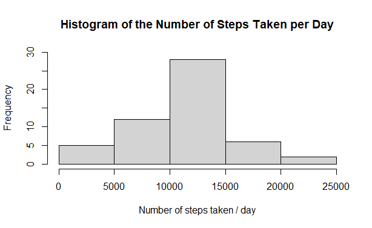
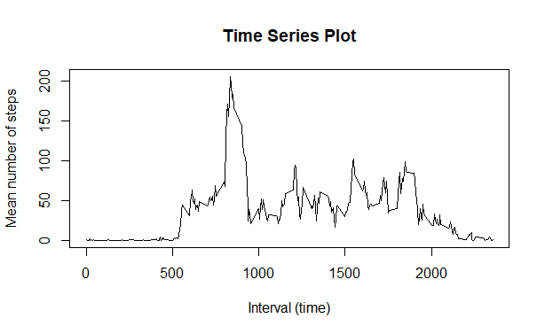
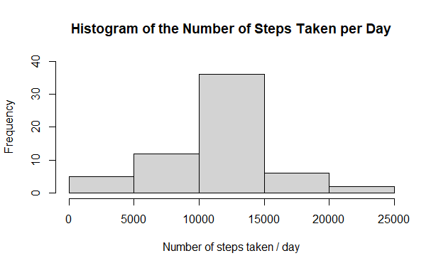
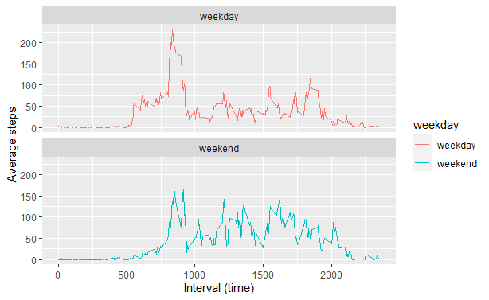

## Loading and preprocessing the data

Code to read in the data and save it in a variable:

```r
data<-read.csv(unz("activity.zip","activity.csv"))
```


## What is mean total number of steps taken per day?

Code to calculate the steps taken per day:

```r
library(tidyr)
library(dplyr)
Steps_Day<-data%>%
  group_by(date)%>%
  summarise(StepsPerDay=sum(steps))
```

Code to make a histogram of the number of steps taken per day:

```r
hist(Steps_Day$StepsPerDay, ylim = c(0,30),
     main = "Histogram of the Number of Steps Taken per Day",
     xlab = "Number of steps taken / day")
```

<!-- -->

Calculating the mean and median of the total number of steps taken per day:

```r
print(paste("mean =", mean(Steps_Day$StepsPerDay, na.rm = TRUE)))
```

```
## [1] "mean = 10766.1886792453"
```

```r
print(paste("median =", median(Steps_Day$StepsPerDay, na.rm = TRUE)))
```

```
## [1] "median = 10765"
```

## What is the average daily activity pattern?

Code to calculate the average daily activity pattern:

```r
activity_pattern<-data[!is.na(data$steps),]%>%
  group_by(interval)%>%
  summarise(perInterval=mean(steps))
```

Code to make a time series plot for the average daily activity pattern:

```r
plot(activity_pattern$interval,activity_pattern$perInterval, type='l',
     main = "Time Series Plot",
     xlab = "Interval (time)",
     ylab = "Mean number of steps")
```

<!-- -->

The 5-minute interval, on average across all the days in the dataset, containing the maximum number of steps:

```r
print(as.numeric(activity_pattern[activity_pattern$perInterval==max(activity_pattern$perInterval),][1]))
```

```
## [1] 835
```

## Imputing missing values

The total number of missing values in the dataset is:

```r
sum(is.na(data$steps))
```

```
## [1] 2304
```

Code for filling in the missing data with the mean of the 5-min interval in a new data set called imputed data or imData for short:

```r
imData<-data
for (i in 1:dim(imData)[1]){
  if (is.na(imData[i,1]) == TRUE) {
    newValue<-activity_pattern[activity_pattern[,1]==imData[i,3],2]
    imData[i,1]<-newValue
  }
} 
```

Seeing the effect imputing the missing values has on the histogram of the number of steps taken per day and the mean and median of the number of steps taken per day.

```r
Steps_Day_im<-imData%>%
  group_by(date)%>%
  summarise(StepsPerDay=sum(steps))

hist(Steps_Day_im$StepsPerDay, ylim = c(0,40),
     main = "Histogram of the Number of Steps Taken per Day",
     xlab = "Number of steps taken / day")
```

<!-- -->

```r
mean(Steps_Day_im$StepsPerDay)
```

```
## [1] 10766.19
```

```r
median(Steps_Day_im$StepsPerDay)
```

```
## [1] 10766.19
```

With the missing values imputed, the mean and median overlap even more closely, and the histogram resembles a normal distribution slightly more than when using the data set with missing values.

## Are there differences in activity patterns between weekdays and weekends?

Code to add another variable to imData showing if a date is a weekday/weekend:

```r
weekday_list<-c("Mon","Tue","Wed", "Thu","Fri")
imData$weekday<-factor(weekdays(as.Date(imData$date), abbreviate = TRUE) %in% weekday_list,
                       levels = c(TRUE,FALSE), labels = c("weekday","weekend"))   
```

Code to calculate the average number of steps per time interval, split on weekday/end:

```r
week_avg<-imData%>%
  group_by(weekday,interval)%>%
  summarise(avgSteps=mean(steps))
```


Code for making a panel plot of the average number of steps taken at the various time intervals on weekdays and weekends:

```r
library(ggplot2)                      
p<-ggplot(data = week_avg, aes(interval,avgSteps, color=weekday))+
  geom_line()+
  labs(x="Interval (time)", y = "Average steps")
p+facet_wrap(~weekday, nrow = 2)
```

<!-- -->

There is definitely a difference between the activity pattern in weekends and weekdays. On weekends, the activity starts at a later time interval and is more constant thorughout the day, compared to weekdays.  

Code for making the plot in base r, just practice for myself which is why the plot is not shown.

```r
par(mfrow=c(2,1))

plot(week_avg[week_avg$weekday=="weekday",]$interval,week_avg[week_avg$weekday=="weekday",]$avgSteps, 
     type = 'l',
     main = "Weekday",
     xlab = "Interval(time)",
     ylab = "Average steps")

plot(week_avg[week_avg$weekday=="weekend",]$interval,week_avg[week_avg$weekday=="weekend",]$avgSteps, 
     type = 'l',
     main = "Weekend",
     xlab = "Interval(time)",
     ylab = "Average steps")
```


